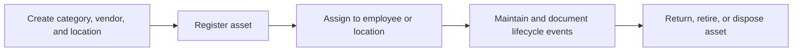

# Asset Management

Asset Management tracks categories, vendors, locations, assets, assignments, maintenance, documents, and disposal.

## User documentation

### Workflow

### How to use it
1. Set up categories, vendors, and locations first.
2. Create assets with tags, purchase details, and condition.
3. Assign assets to employees and track returns.
4. Log maintenance, upload files, and monitor status history.
5. Dispose or retire assets when they leave service.

## Technical documentation

- Primary routes: `/assets`, `/asset-categories`, `/asset-vendors`, `/asset-locations`
- Backend controllers: `AssetController`, `AssetCategoryController`, `AssetVendorController`, `AssetLocationController`, `AssetMaintenanceController`
- Frontend pages: `resources/js/pages/Assets/`, `AssetCategories/`, `AssetVendors/`, `AssetLocations/`
- Key permissions: `assets.*`, `assets.categories.*`, `assets.vendors.*`, `assets.locations.*`, `assets.maintenance.*`
- Related models: `Asset`, `AssetCategory`, `AssetVendor`, `AssetLocation`, `AssetAssignment`, `AssetMaintenanceRecord`

