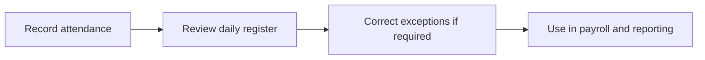

# Attendance

Attendance tracks employee presence, shifts, and attendance administration across the active organization.

## User documentation

### Workflow

### How to use it
1. Capture or import attendance records.
2. Review the register and fix missing or incorrect entries.
3. Use filters and role scope to focus on your own records, team records, or organization view.
4. Pass validated attendance data into payroll and reports.

## Technical documentation

- Primary routes: `/attendance-records`
- Backend controller: `app/Http/Controllers/AttendanceRecordController.php`
- Frontend pages: `resources/js/pages/AttendanceRecords/`
- Key permissions: `attendance.*`
- Reporting: `app/Http/Controllers/Reports/AttendanceRecordReportController.php`

