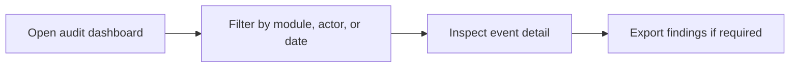

# Audit Trail

Audit Trail provides read-only operational history for compliance, investigations, and change tracing.

## User documentation

### Workflow

### How to use it
1. Use filters to reduce the event set quickly.
2. Open a specific entry to inspect actor, timestamp, and changed values.
3. Export evidence when an audit or investigation needs an external pack.

## Technical documentation

- Primary routes: `/audit-trail`, `/audit-trail/logs`, `/audit-trail/{log}`
- Backend controller: `app/Http/Controllers/AuditTrailController.php`
- Frontend pages: `resources/js/pages/AuditTrail/`
- Key permissions: `audit.view`, `audit.export`, `audit.manage`
- Related model: audit log/event persistence used by system actions

