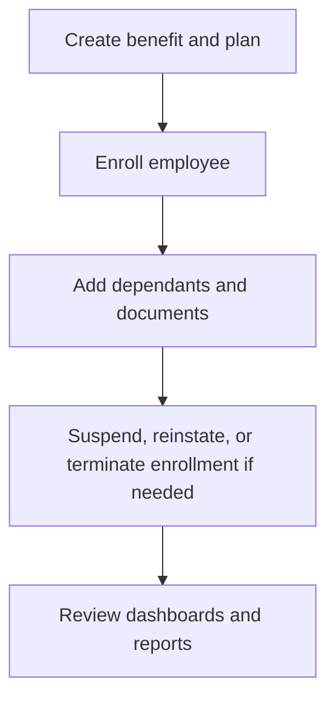

# Benefits

Benefits covers benefit definitions, plans, enrollments, dependants, contribution rules, dashboards, and reports.

## User documentation

### Workflow

### How to use it
1. Create the benefit and plan structure first.
2. Enroll eligible employees and add dependants or documents where needed.
3. Use the enrollment show page to manage status changes and history.
4. Review benefits dashboards and reports for utilization and operational tracking.

## Technical documentation

- Primary routes: `/benefits`, `/benefit-plans`, `/benefit-enrollments`, `/benefits/dashboard`
- Backend controllers: `BenefitController`, `BenefitPlanController`, `EmployeeBenefitEnrollmentController`, `EmployeeBenefitDependantController`, `BenefitContributionRuleController`, `BenefitsDashboardController`
- Frontend pages: `resources/js/pages/Benefits/`
- Key permissions: `benefits.*`
- Reporting: `app/Http/Controllers/Reports/BenefitReportController.php`

