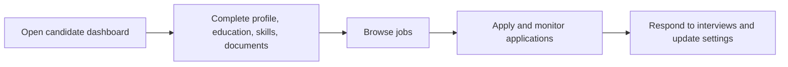

# Candidate Hub

Candidate Hub is the self-service workspace used by external candidates to maintain profiles and apply for jobs.

## User documentation

### Workflow

### How to use it
1. Complete the profile and upload supporting documents first.
2. Keep education and skills current to improve job application quality.
3. Browse jobs, apply, and monitor application status from the hub.
4. Use settings to control notifications and candidate visibility.

## Technical documentation

- Primary routes: `/candidate/dashboard`, `/candidate/profile`, `/candidate/jobs`, `/candidate/applications`
- Backend controllers: `app/Http/Controllers/Candidate/`
- Frontend pages: `resources/js/pages/Candidate/`
- Portal type: `candidate`
- Related submodules: documents, education, skills, interview responses

