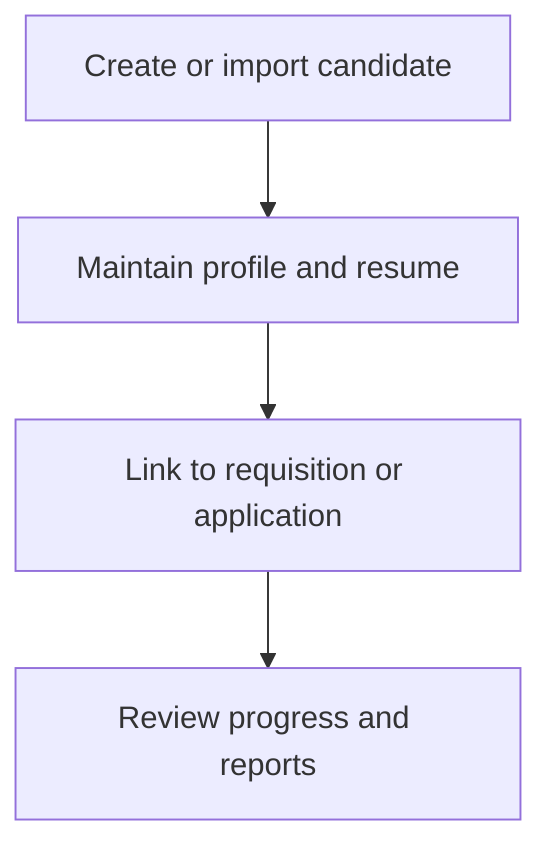

# Candidate Records

Candidate Records covers internal candidate profiles, resumes, candidate CRUD, and candidate reporting inside the employee portal.

## User documentation

### Workflow

### How to use it
1. Maintain candidate master data from the candidate pages.
2. Keep resumes and related profile details current.
3. Use candidate records together with requisitions and applications.

## Technical documentation

- Primary routes: `/candidates`
- Backend controller: `app/Http/Controllers/CandidateProfileController.php`
- Frontend pages: `resources/js/pages/Candidates/` and `Recruitment/Candidates/`
- Key permissions: `candidates.*`
- Reporting: `app/Http/Controllers/Reports/CandidateProfileReportController.php`
