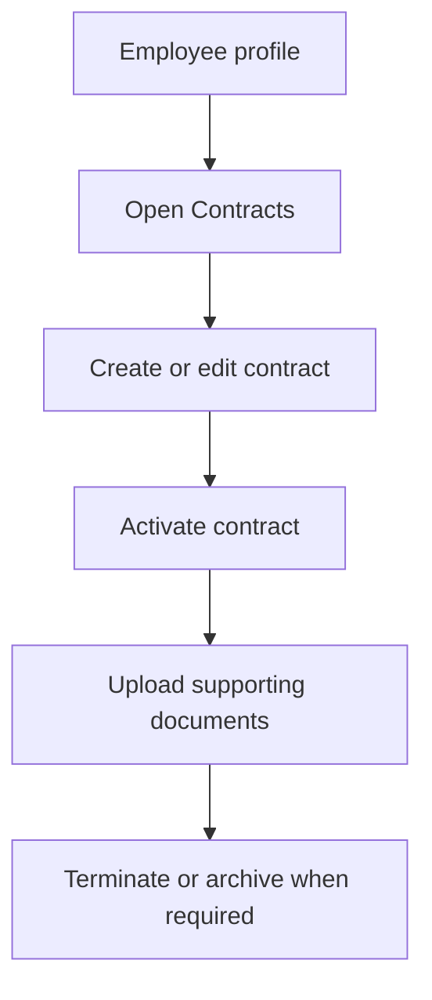

# Contracts

Contracts manages employee agreements, contract activation, termination, and contract documents.

## User documentation

### Workflow

### How to use it
1. Open contracts from an employee profile.
2. Create a new contract with dates, terms, and compensation references.
3. Activate the current contract when it becomes effective.
4. Upload signed agreements and related attachments.
5. Terminate or archive the contract when the employment state changes.

## Technical documentation

- Route group: `/employees/{employee}/contracts`
- Backend controller: `app/Http/Controllers/EmployeeContractController.php`
- Frontend pages: `resources/js/pages/Employees/Contracts/`
- Key permissions: `contracts.view`, `contracts.create`, `contracts.update`, `contracts.activate`, `contracts.terminate`, `contracts.documents.manage`
- Related models: `EmployeeContract` and contract document records

