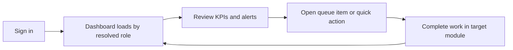

# Dashboard

The dashboard is the landing workspace for the employee portal. It surfaces role-specific KPIs, action queues, alerts, and shortcuts so each user starts from the highest-priority work.

## User documentation

### Workflow

### How to use it
1. Open the cards and charts at the top to understand current workload.
2. Use the quick actions to jump directly into your primary modules.
3. Review approval queues and recent activity before leaving the page.
4. Use the sidebar to move into the operational module linked to the card.

### Roles
- Employee: self-service metrics and reminders.
- Manager: team workload, direct reports, approvals.
- HR Admin / System Admin: cross-module operational view.
- Payroll / Authoriser / Auditor: role-specific control surfaces.

## Technical documentation

- Primary route: `/dashboard`
- Backend entry point: `app/Http/Controllers/DashboardController.php`
- Role variant resolution: `app/Support/Dashboard/RoleDashboardResolver.php`
- Variant data assembly: `app/Support/Dashboard/RoleDashboardBuilder.php`
- Frontend entry: `resources/js/pages/Dashboard.tsx`
- Shared cards/components: `resources/js/pages/dashboard/`
- Key permission: `dashboard.view`

