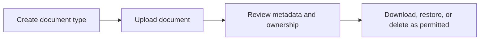

# Documents Repository

Documents Repository manages shared documents, document types, recoverability, and cross-module document access.

## User documentation

### Workflow

### How to use it
1. Create document types before bulk uploading into the repository.
2. Upload documents with the correct metadata and ownership.
3. Use document lists and show pages to download, restore, or remove records.
4. Use employee OCR where document intelligence is required.

## Technical documentation

- Primary routes: `/documents`, `/document-types`
- Backend controllers: `DocumentController`, `DocumentTypeController`
- Frontend pages: `resources/js/pages/Documents/`, `DocumentTypes/`
- Key permissions: `documents.*`, `document_types.*`
- Related submodule: employee OCR under `/employees/{employee}/documents`

