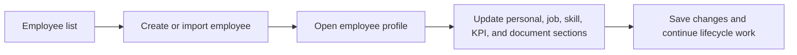

# Employee Management

Employee Management is the system of record for workforce profiles, employment details, employee subrecords, bulk upload, and employee document/OCR history.

## User documentation

### Workflow

### How to use it
1. Use the index page to search, filter, and sort employees.
2. Open a profile to manage next of kin, job profile, skills, KPIs, and OCR documents.
3. Use bulk upload when onboarding large groups from templates.
4. Use the show page as the operational hub for employee-linked modules.

### Roles
- HR Admin and System Admin manage the full employee record.
- Managers mostly use employee profiles for direct-report context.
- Employees access role-scoped self data where permitted.

## Technical documentation

- Primary routes: `/employees`, `/employees/{employee}`, `/employees/upload`
- Backend entry point: `app/Http/Controllers/EmployeeController.php`
- Employee documents/OCR: `app/Http/Controllers/EmployeeDocumentController.php`, `app/Http/Controllers/OcrController.php`
- Frontend pages: `resources/js/pages/Employees/`
- Key permissions: `employees.*`, `documents.*`
- Related models: `Employee`, `Document`, `OcrResult`

