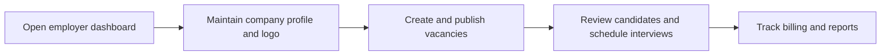

# Employer Hub

Employer Hub is the self-service workspace used by employer accounts to manage vacancies, candidates, interviews, company profile, billing, and reports.

## User documentation

### Workflow

### How to use it
1. Maintain the company profile and subscription details first.
2. Create vacancies and manage the candidate pipeline from the hub.
3. Schedule interviews and review candidate resumes.
4. Use reports and billing pages for commercial follow-up.

## Technical documentation

- Primary routes: `/employer/dashboard`, `/employer/vacancies`, `/employer/candidates`, `/employer/company`, `/employer/billing`
- Backend controllers: `app/Http/Controllers/Employer/`
- Frontend pages: `resources/js/pages/Employer/`
- Portal type: `employer`
- Related submodules: interviews, vacancy lifecycle, candidate resume preview/download

