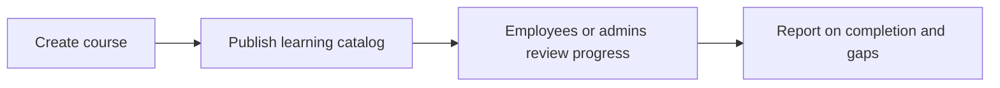

# Learning

Learning manages courses, compliance training, and development catalogues linked to employee growth.

## User documentation

### Workflow

### How to use it
1. Create or update learning courses in the catalog.
2. Use the course pages to maintain compliance and development content.
3. Review completion and training gaps from reports or dashboards.

## Technical documentation

- Primary routes: `/learning-courses`
- Backend controller: `app/Http/Controllers/LearningCourseController.php`
- Frontend pages: `resources/js/pages/LearningCourses/`
- Key permissions: `learning.*`
- Reporting: `app/Http/Controllers/Reports/LearningCourseReportController.php`

