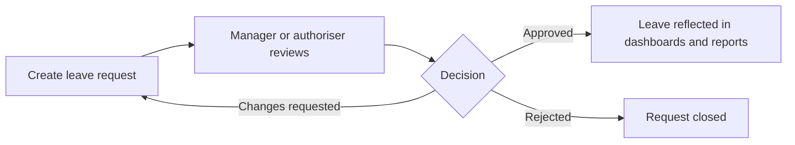

# Leave Management

Leave Management supports leave requests, approvals, balances, and leave-related operational visibility.

## User documentation

### Workflow

### How to use it
1. Submit a leave request with dates, type, and notes.
2. Managers or authorisers review and approve, reject, or request changes.
3. HR monitors status, balances, and exceptions from the leave pages and dashboard.

## Technical documentation

- Primary routes: `/leave-requests`
- Backend controller: `app/Http/Controllers/LeaveRequestController.php`
- Frontend pages: `resources/js/pages/LeaveRequests/`
- Key permissions: `leave.*`
- Reporting: `app/Http/Controllers/Reports/LeaveRequestReportController.php`

