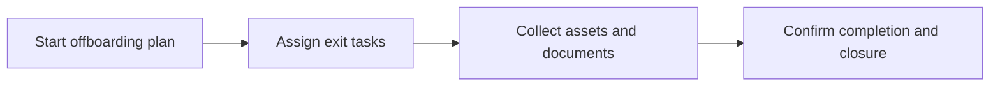

# Offboarding

Offboarding manages employee exit tasks, ownership, recoveries, and closure evidence.

## User documentation

### Workflow

### How to use it
1. Open an offboarding task set when an employee exit is confirmed.
2. Track asset returns, documentation, and handover requirements.
3. Close the offboarding plan only after all mandatory items are complete.

## Technical documentation

- Primary routes: `/offboarding-tasks`
- Backend controller: `app/Http/Controllers/OffboardingTaskController.php`
- Frontend pages: `resources/js/pages/OffboardingTasks/`
- Key permissions: `offboarding.*`
- Reporting: `app/Http/Controllers/Reports/OffboardingTaskReportController.php`

