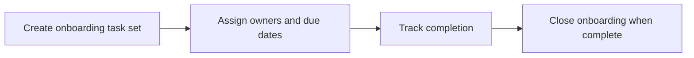

# Onboarding

Onboarding tracks starter tasks, ownership, due dates, and completion progress for new hires.

## User documentation

### Workflow

### How to use it
1. Create onboarding tasks as soon as the hire is confirmed.
2. Assign each task to the responsible owner.
3. Track overdue items and completion from the dashboard and reports.

## Technical documentation

- Primary routes: `/onboarding-tasks`
- Backend controller: `app/Http/Controllers/OnboardingTaskController.php`
- Frontend pages: `resources/js/pages/OnboardingTasks/`
- Key permissions: `onboarding.*`
- Reporting: `app/Http/Controllers/Reports/OnboardingTaskReportController.php`

