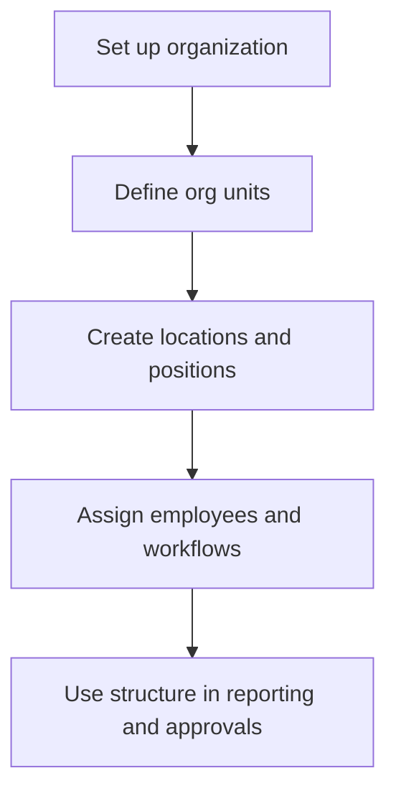

# Organization Structure

Organization Structure covers tenant organizations, org units, locations, and positions used across employee, payroll, and reporting workflows.

## User documentation

### Workflow

### How to use it
1. Create or update the active organization.
2. Define org units such as departments, branches, or teams.
3. Maintain locations and positions for workforce planning.
4. Use the structure across employee records, approvals, and reports.

## Technical documentation

- Primary routes: `/organizations`, `/org-units`, `/locations`, `/positions`
- Backend controllers: `OrganizationController`, `OrgUnitController`, `LocationController`, `PositionController`
- Frontend pages: `resources/js/pages/Organizations/`, `OrgUnits/`, `Locations/`, `Positions/`
- Key permissions: `organizations.*`, `org_units.*`, `locations.*`, `positions.*`
- Related models: `Organization`, `OrgUnit`, `Location`, `Position`

