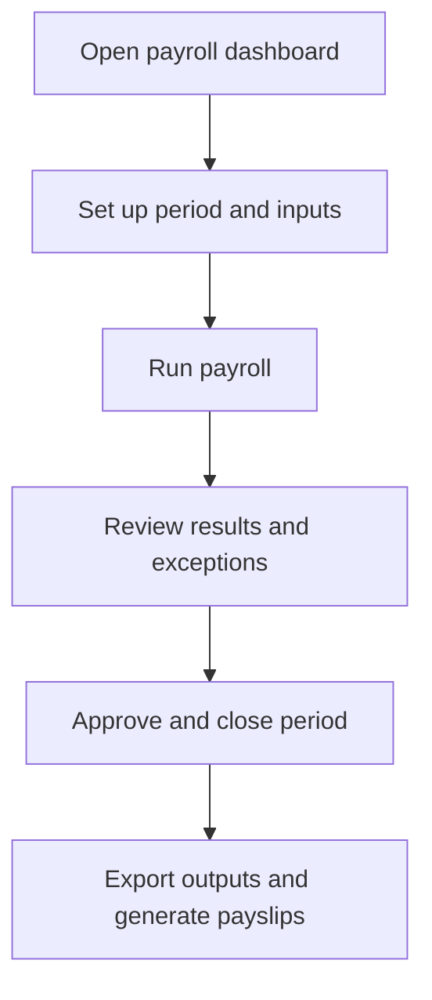

# Payroll

Payroll manages payroll periods, inputs, pay codes, results, approvals, closure, and exports.

## User documentation

### Workflow

### How to use it
1. Confirm period, pay codes, and payroll inputs.
2. Run payroll and inspect warnings before approval.
3. Approve and close the period only when outputs are final.
4. Use the export and reports screens for downstream finance processes.

## Technical documentation

- Primary routes: `/payroll`, `/payroll-periods`, `/payroll-results`, `/payroll-inputs`
- Backend controllers: `PayrollDashboardController`, `PayrollPeriodController`, `PayrollResultController`, `PayrollInputController`, `PayrollPayCodeController`, `EmployeePayrollProfileController`
- Frontend pages: `resources/js/pages/Payroll/`
- Key permissions: `payroll.*`
- Reporting: `PayrollReportController`, `Reports/PayrollExportReportController.php`

