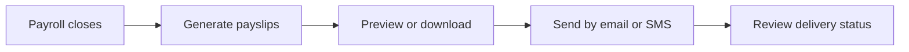

# Payslips

Payslips handles payslip viewing, downloads, email distribution, SMS summaries, and delivery tracking.

## User documentation

### Workflow

### How to use it
1. Open the payslip list for the target period or employee.
2. Preview or download the PDF before distribution.
3. Use email or SMS actions for individual or bulk delivery.
4. Monitor delivery failures and retry where needed.

## Technical documentation

- Primary routes: `/payslips`
- Backend controllers: `PayslipController`, `PayslipDeliveryController`
- Frontend pages: `resources/js/pages/Payslips/`
- Key permissions: `payslips.*`
- Related models: payslip delivery and distribution tracking records

