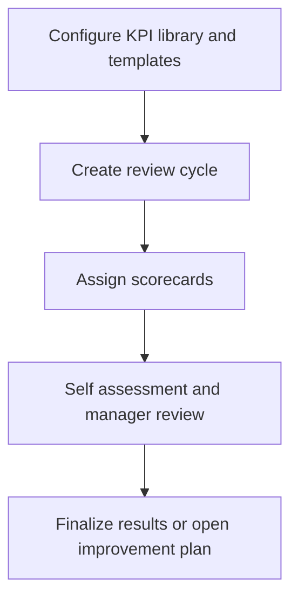

# Performance Management

Performance Management covers review cycles, KPI library, scorecard templates, employee scorecards, reviews, and improvement plans.

## User documentation

### Workflow

### How to use it
1. Build KPIs and templates before starting the cycle.
2. Create the cycle and assign employee scorecards.
3. Use review pages to complete self and manager assessments.
4. Open improvement plans when follow-up actions are required.

## Technical documentation

- Primary routes: `/performance`, `/performance-cycles`, `/kpi-library`, `/scorecard-templates`, `/employee-scorecards`, `/improvement-plans`, `/performance-reviews`
- Backend controllers: `PerformanceDashboardController`, `PerformanceCycleController`, `KpiLibraryController`, `ScorecardTemplateController`, `EmployeeScorecardController`, `PerformanceImprovementPlanController`, `PerformanceReviewController`
- Frontend pages: `resources/js/pages/Performance/`
- Key permissions: `performance.*`
- Reporting: `Reports/PerformanceReviewReportController.php`, `Reports/PerformanceScorecardReportController.php`

