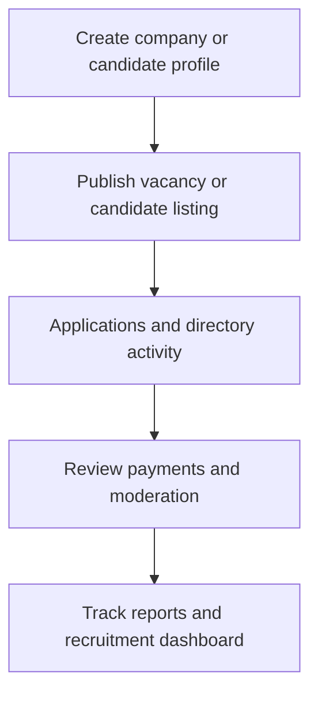

# Recruitment Marketplace

Recruitment Marketplace covers recruitment admin, candidate directory, company profiles, vacancies, applications, payments, and public job-market interactions.

## User documentation

### Workflow

### How to use it
1. Manage candidate and company profiles from the recruitment admin pages.
2. Publish vacancies and monitor applications.
3. Use the candidate directory and recruitment dashboard for marketplace operations.
4. Review payments, moderation, and reports for commercial control.

## Technical documentation

- Primary routes: `/recruitment`, `/candidate-profiles`, `/company-profiles`, `/vacancies`, `/vacancy-applications`, `/candidate-directory`
- Backend controllers: `RecruitmentDashboardController`, `CandidateProfileController`, `CompanyProfileController`, `VacancyController`, `VacancyApplicationController`, `CandidateDirectoryController`
- Frontend pages: `resources/js/pages/Recruitment/`
- Key permissions: `recruitment.*`
- Related services: marketplace ranking and recruitment reporting

