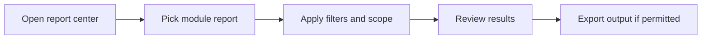

# Reports

Reports consolidates operational report screens and exports across workforce, payroll, recruitment, performance, and system activity.

## User documentation

### Workflow

### How to use it
1. Start in the report center to choose the report category.
2. Apply date, status, organization, or role-based filters.
3. Review the result set before exporting.
4. Export only when the current role has export rights for that report.

## Technical documentation

- Primary routes: `/reports`
- Backend report controllers: `app/Http/Controllers/Reports/`
- Frontend pages: `resources/js/pages/Reports/`
- Key permissions: `reports.view`, `reports.export`
- Role scoping applies through the shared page-scope resolver where implemented

