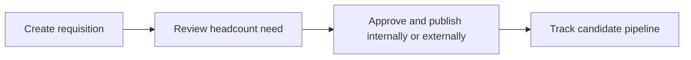

# Requisitions

Requisitions manages internal hiring requests and vacancy demand before marketplace publication or candidate processing.

## User documentation

### Workflow

### How to use it
1. Create the requisition with department, role, and justification.
2. Review status and approvals before releasing it to recruiting activity.
3. Use linked candidate and application data to monitor fill progress.

## Technical documentation

- Primary routes: `/job-requisitions`
- Backend controller: `app/Http/Controllers/JobRequisitionController.php`
- Frontend pages: `resources/js/pages/JobRequisitions/`
- Key permissions: `requisitions.*`
- Reporting: `app/Http/Controllers/Reports/JobRequisitionReportController.php`

