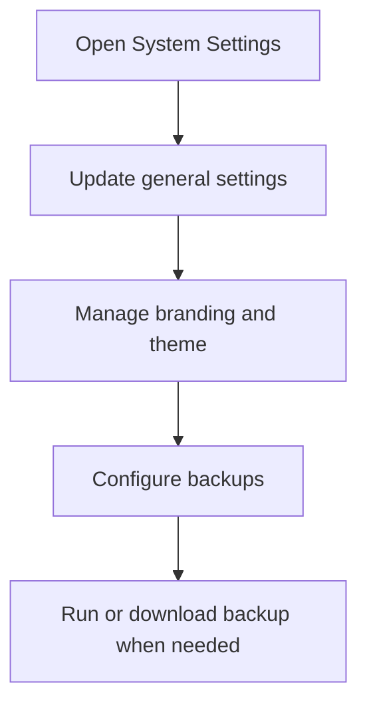

# System Settings

System Settings centralizes branding, general settings, backups, and operational preferences for the tenant.

## User documentation

### Workflow

### How to use it
1. Update general organization settings first.
2. Maintain branding assets and theme preferences.
3. Configure backup retention and manual runs.
4. Download or email backups through the backup controls when permitted.

## Technical documentation

- Route group: `/system-settings`
- Backend controller: `app/Http/Controllers/SystemSettingsController.php`
- Frontend page: `resources/js/pages/SystemSettings/Index.tsx`
- Key permissions: `settings.*`, `branding.manage`, `backups.*`
- Related services: backup services and branding upload helpers

