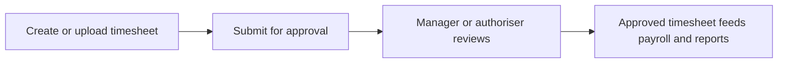

# Timesheets

Timesheets manages submitted time records, approvals, imports, and exception handling.

## User documentation

### Workflow

### How to use it
1. Create a timesheet or use the bulk upload flow.
2. Submit the record for approval where applicable.
3. Review pending, approved, and rejected entries from the index.
4. Resolve exceptions before payroll processing.

## Technical documentation

- Primary routes: `/timesheets`
- Backend controller: `app/Http/Controllers/TimesheetController.php`
- Frontend pages: `resources/js/pages/Timesheets/`
- Key permissions: `timesheets.*`
- Reporting: `app/Http/Controllers/Reports/TimesheetReportController.php`

