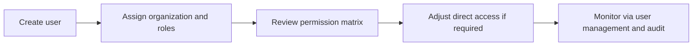

# User Access and Control Center

This module manages user accounts, role assignments, permission matrices, and the administration surfaces grouped under the Control Center.

## User documentation

### Workflow

### How to use it
1. Create or update user accounts from User Management.
2. Assign roles at the correct organization scope.
3. Review the role matrix in the Control Center before changing access.
4. Use impersonation only for controlled support and troubleshooting.

## Technical documentation

- Primary routes: `/users`, `/roles`, `/control-center`
- Backend controllers: `UserController`, `RoleController`, `PermissionMatrixController`, `ControlCenterController`
- Frontend pages: `resources/js/pages/Users/`, `Roles/`, `ControlCenter/`
- Key permissions: `users.*`, `roles.*`, `permissions.*`
- Access catalogue: `config/rbac.php`
- Enforcement: `app/Http/Middleware/EnsureUserHasPermission.php`

