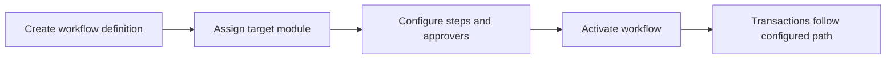

# Workflows

Workflows defines approval paths and module-specific process orchestration.

## User documentation

### Workflow

### How to use it
1. Create a workflow for the target module.
2. Define the approval steps in the required order.
3. Activate the workflow and test it with a transaction.
4. Review workflow reports when approval timing or routing needs tuning.

## Technical documentation

- Primary routes: `/workflows`
- Backend controller: `app/Http/Controllers/WorkflowDefinitionController.php`
- Frontend pages: `resources/js/pages/WorkflowDefinitions/`
- Key permissions: `workflows.*`
- Related reports: `Reports/WorkflowDefinitionReportController.php`

