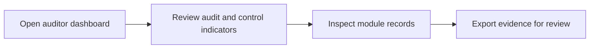

# Auditor

Auditor is a read-only oversight role focused on compliance, controls, and evidence collection.

## User documentation

### Workflow

### Primary modules
- Audit Trail
- Reports
- Documents Repository
- Payroll
- User Access and Control Center

## Technical documentation

- Resolved dashboard role: `auditor`
- Seeded role code: `AUDITOR`
- Shared page scoping is read-only where the resolver is applied
- Typical permissions center on `audit.*`, view-only operational modules, and report export

