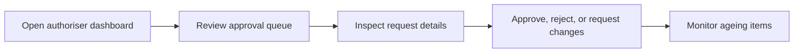

# Authoriser

Authoriser is an approval-heavy role focused on queue handling, turnaround time, and controlled decision making.

## User documentation

### Workflow

### Primary modules
- Leave Management
- Timesheets
- Payroll
- Documents Repository
- Reports

## Technical documentation

- Resolved dashboard role: `authoriser`
- Seeded role code: `AUTHORISER`
- Shared page scoping uses approval-focused queues where implemented
- Key permissions: `leave.approve`, `timesheets.approve`, `payroll.approve`, `payroll.close`

