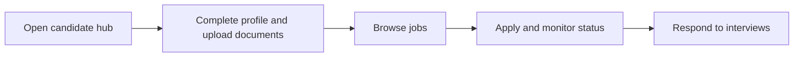

# Candidate

Candidate is the external portal role used to maintain a candidate profile and apply for jobs in the marketplace.

## User documentation

### Workflow

### Primary modules
- Candidate Hub
- Recruitment Marketplace
- Candidate Records

## Technical documentation

- Portal type: `candidate`
- Primary routes live under `/candidate/*`
- Controllers live under `app/Http/Controllers/Candidate/`
- Candidate portal access is resolved through the unified portal access layer

