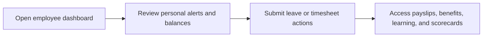

# Employee

Employee is the self-service role for personal requests, profile visibility, payslips, and day-to-day workforce interactions.

## User documentation

### Workflow

### Primary modules
- Dashboard
- Leave Management
- Attendance
- Timesheets
- Benefits
- Payslips

## Technical documentation

- Resolved dashboard role: `employee`
- Seeded role code: `EMPLOYEE`
- Shared page scoping defaults to self-only records where applied
- Key permissions are self-service oriented and defined in `config/rbac.php`

