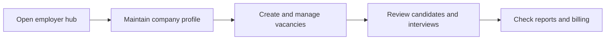

# Employer

Employer is the external portal role used by company accounts to manage vacancies, candidates, interviews, billing, and employer branding.

## User documentation

### Workflow

### Primary modules
- Employer Hub
- Recruitment Marketplace
- Reports

## Technical documentation

- Portal type: `employer`
- Primary routes live under `/employer/*`
- Controllers live under `app/Http/Controllers/Employer/`
- Employer access is resolved through the unified portal access layer and company profile ownership

