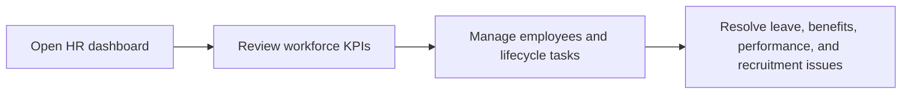

# HR Administrator

HR Administrator owns workforce operations, people data quality, talent operations, and most administrative employee workflows.

## User documentation

### Workflow

### Primary modules
- Employees
- Leave Management
- Onboarding and Offboarding
- Benefits
- Performance Management
- Recruitment Marketplace

## Technical documentation

- Resolved dashboard role: `hr_admin`
- Seeded role code: `HR_ADMIN`
- Default permissions come from `config/rbac.php`
- Typical surfaces: employee CRUD, lifecycle, reporting, benefits, performance, recruitment admin

