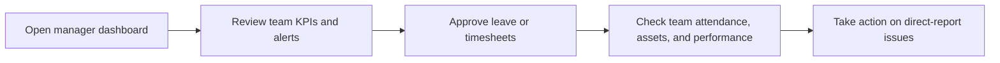

# Manager

Manager is a team-focused role centered on direct reports, approvals, operational follow-through, and employee performance.

## User documentation

### Workflow

### Primary modules
- Dashboard
- Employees
- Leave Management
- Timesheets
- Performance Management
- Assets

## Technical documentation

- Resolved dashboard role: `manager`
- Seeded role code: `MANAGER`
- Record visibility defaults to direct reports where the shared page scope applies
- Key permissions include `leave.approve`, `timesheets.approve`, `performance.review`

