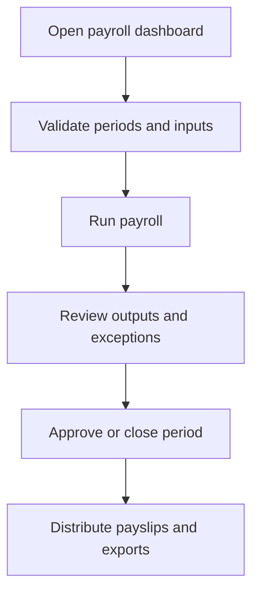

# Payroll Officer

Payroll Officer controls payroll setup, processing, review, closure, payslip distribution, and payroll reporting.

## User documentation

### Workflow

### Primary modules
- Payroll
- Payslips
- Timesheets
- Attendance
- Reports

## Technical documentation

- Resolved dashboard role: `payroll`
- Seeded role code: `PAYROLL`
- Key permissions: `payroll.*`, `payslips.*`, supporting time and attendance visibility
- Main controllers live under `app/Http/Controllers/Payroll*` and `Payslip*`

