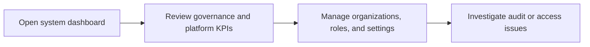

# System Administrator

System Administrator is the highest operational role in the employee portal. This role oversees tenant setup, access control, auditability, and platform-wide health.

## User documentation

### Workflow

### Primary modules
- Dashboard
- Organization Structure
- User Access and Control Center
- Audit Trail
- System Settings

## Technical documentation

- Resolved dashboard role: `system_admin`
- Source of truth: `app/Support/Dashboard/RoleDashboardResolver.php`
- Typical permissions: `*` for seeded `SYS_ADMIN`
- Portal context: employee portal with broad cross-module visibility

